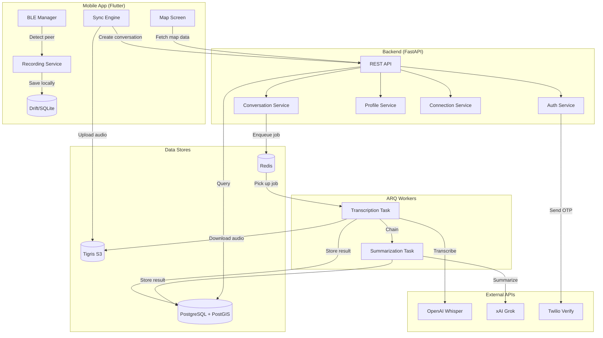
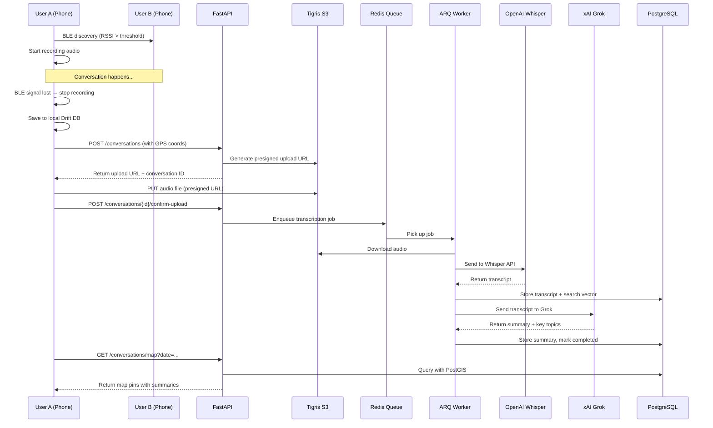
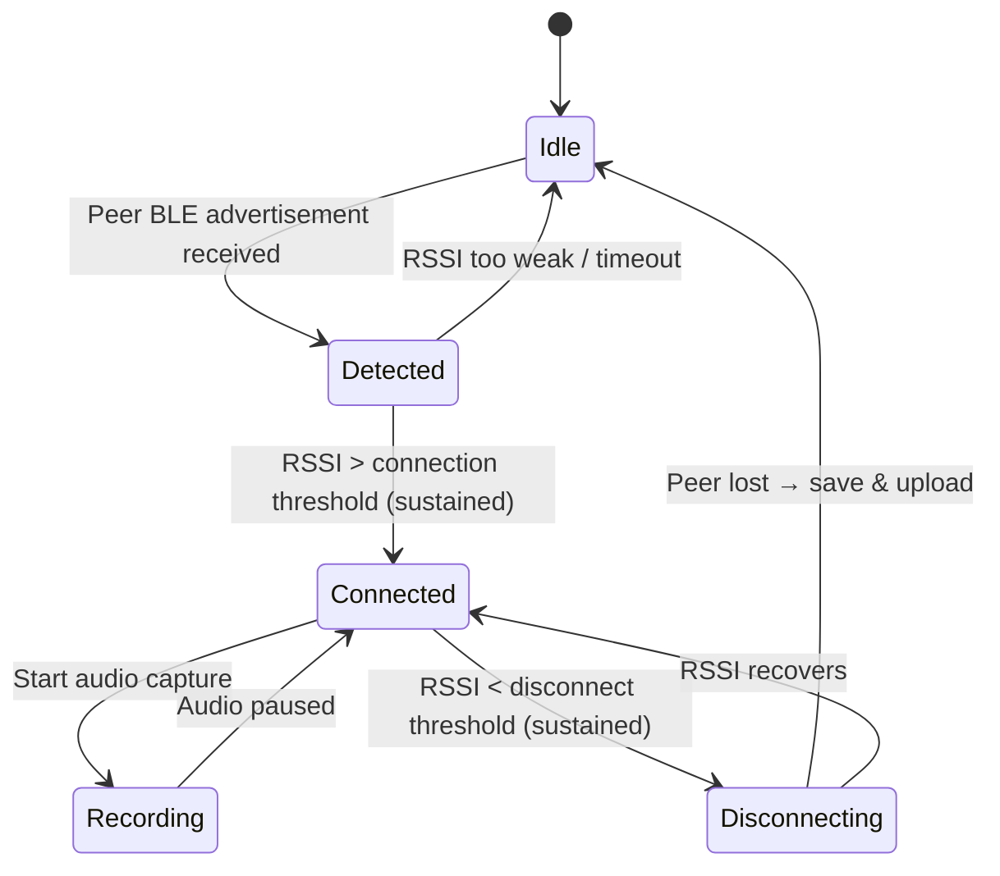

<p align="center">
  <picture>
    <source media="(prefers-color-scheme: dark)" srcset="assets/Primary%20Logo%20-%20No%20BG%20Dark.png" />
    <source media="(prefers-color-scheme: light)" srcset="assets/Primary%20Logo%20-%20No%20BG.png" />
    
  </picture>
</p>

<p align="center">
  <em>Never forget a connection.</em>
</p>

<p align="center">
  A mobile app that runs in your pocket — detecting nearby people via Bluetooth, recording and transcribing your conversations with AI, and pinning every encounter to a map you can revisit anytime.
</p>

<p align="center">
  <a href="https://github.com/LakshmanTurlapati/LinkLess/stargazers">
    
  </a>
  <a href="https://github.com/LakshmanTurlapati/LinkLess/network/members">
    
  </a>
  <a href="https://github.com/LakshmanTurlapati/LinkLess/issues">
    
  </a>
  <a href="https://github.com/LakshmanTurlapati/LinkLess/commits/main">
    
  </a>
</p>

---

> [!IMPORTANT]
> LinkLess is under active development and not yet available on the App Store or Google Play. Recording features require two-party consent where required by law.

## The Problem

You meet someone at a conference, a coffee shop, a party. You have a great conversation — then a week later, you can't remember their name, what you talked about, or how to find them again.

## The Solution

LinkLess runs quietly in your pocket. When two users are nearby, their phones discover each other over **Bluetooth Low Energy**. The app **passively records** the conversation, **transcribes** it with OpenAI Whisper, **summarizes** it with xAI Grok, and **pins it to a map** so you can revisit every encounter — who, what, and where. Want to stay in touch? Send a connection request and exchange socials.

---

## Screenshots

<table>
  <tr>
    <td align="center"><strong>Login</strong></td>
    <td align="center"><strong>Conversations Map</strong></td>
    <td align="center"><strong>Profile View</strong></td>
  </tr>
  <tr>
    <td></td>
    <td></td>
    <td></td>
  </tr>
</table>

---

## Features

| Feature | Description |
|---|---|
| **BLE Proximity Detection** | Automatically discovers nearby LinkLess users via Bluetooth Low Energy scanning and advertising — no manual pairing needed |
| **Passive Audio Recording** | Records conversations in the background using a foreground service with configurable audio sessions |
| **AI Transcription & Summarization** | Transcribes audio with OpenAI Whisper, then summarizes key topics with xAI Grok — all asynchronously via an ARQ task queue |
| **Interactive Map** | Every conversation is GPS-tagged and displayed on a Mapbox map with date-based navigation |
| **Social Connections** | Send connection requests after a conversation; once mutually accepted, exchange Instagram, LinkedIn, X, and Snapchat handles |
| **Offline-First** | Local Drift/SQLite database stores conversations, transcripts, and blocked users — syncs to the cloud when connectivity returns |
| **Full-Text Search** | PostgreSQL `tsvector` powered search across transcripts, summaries, and peer names with ranked results and snippet highlights |
| **Privacy Controls** | Anonymous mode hides your identity from peers; invisible mode stops BLE advertising entirely; block users at any time |
| **Phone Auth with OTP** | Passwordless authentication via Twilio Verify SMS — no emails, no passwords, just your phone number |

---

## Architecture

### System Overview



### Conversation Lifecycle



### BLE Proximity State Machine



---

## Tech Stack

<p align="center">
  <strong>Backend</strong><br/>
  
  
  
  
  
</p>

<p align="center">
  <strong>Mobile</strong><br/>
  
  
  
  
</p>

<p align="center">
  <strong>AI & Services</strong><br/>
  
  
  
  
</p>

---

## Project Structure

```
LinkLess/
├── assets/                          # Shared design assets & UI mockups
├── resources/                       # Pitch deck and documents
├── docker-compose.yml               # PostgreSQL + Redis + API + Worker
│
├── backend/
│   ├── main.py                      # FastAPI app entry point
│   ├── Dockerfile                   # Multi-stage Python 3.12 build
│   ├── fly.toml                     # Fly.io deployment config
│   ├── requirements.txt             # Pinned Python dependencies
│   ├── alembic.ini                  # Database migration config
│   ├── alembic/versions/            # 6 migration scripts (PostGIS → search vectors)
│   └── app/
│       ├── api/v1/
│       │   ├── router.py            # Aggregates all route modules
│       │   └── routes/
│       │       ├── auth.py          # OTP send/verify, token refresh, logout
│       │       ├── conversations.py # CRUD, map queries, full-text search
│       │       ├── connections.py   # Request/accept/decline, block/unblock
│       │       ├── profile.py       # Profile CRUD, photo presign, social links
│       │       ├── uploads.py       # Generic presigned URL generation
│       │       └── health.py        # Health check endpoint
│       ├── core/
│       │   ├── config.py            # Pydantic Settings (all env vars)
│       │   ├── database.py          # Async SQLAlchemy engine & sessions
│       │   ├── dependencies.py      # FastAPI DI (JWT auth, current user)
│       │   └── security.py          # JWT creation/decoding, password hashing
│       ├── models/                  # SQLAlchemy models (7 tables + PostGIS)
│       ├── schemas/                 # Pydantic request/response schemas
│       ├── services/               # Business logic layer
│       │   ├── auth_service.py      # Twilio OTP + session management
│       │   ├── conversation_service.py
│       │   ├── connection_service.py
│       │   ├── profile_service.py
│       │   ├── storage_service.py   # Tigris/S3 presigned URLs
│       │   ├── transcription_service.py  # OpenAI Whisper integration
│       │   └── summarization_service.py  # xAI Grok integration
│       └── tasks/
│           ├── transcription.py     # ARQ task: transcribe audio
│           ├── summarization.py     # ARQ task: summarize transcript
│           └── worker.py            # ARQ worker config (5 concurrent, 10min timeout)
│
└── mobile/
    ├── pubspec.yaml                 # Flutter dependencies & config
    └── lib/
        ├── main.dart                # App entry point
        ├── app.dart                 # Root widget
        ├── ble/                     # Bluetooth Low Energy
        │   ├── ble_manager.dart     # Central orchestrator
        │   ├── ble_central_service.dart   # BLE scanning
        │   ├── ble_peripheral_service.dart # BLE advertising
        │   ├── proximity_state_machine.dart # State transitions
        │   └── rssi_filter.dart     # Signal strength filtering
        ├── core/
        │   ├── config/app_config.dart     # Runtime config (API URL, Mapbox)
        │   ├── network/dio_client.dart    # HTTP client with auth interceptor
        │   └── theme/               # App colors & theme
        ├── features/
        │   ├── auth/                # Phone OTP login flow
        │   ├── map/                 # Mapbox conversation map + date nav
        │   ├── recording/           # Audio capture, local DB, playback
        │   ├── conversations/       # Conversation list screen
        │   ├── connections/         # Connection requests & social links
        │   ├── profile/             # Profile CRUD, photo upload, encounter cards
        │   ├── search/              # Full-text search UI
        │   └── sync/               # Cloud sync engine & upload service
        └── router/                  # GoRouter navigation
```

---

## Getting Started

### Prerequisites

- **Docker** & **Docker Compose** (recommended for backend)
- **Python 3.12+** (if running backend manually)
- **Flutter 3.7+** / Dart 3.7+
- **Xcode** (iOS) or **Android Studio** (Android)

### Clone

```bash
git clone https://github.com/LakshmanTurlapati/LinkLess.git
cd LinkLess
```

### Backend Setup

#### Option A: Docker Compose (recommended)

```bash
cp backend/.env.example backend/.env
# Edit backend/.env with your API keys

docker compose up -d
```

This starts PostgreSQL 16 + PostGIS, Redis 7, the FastAPI server, and the ARQ worker.

#### Option B: Manual

```bash
cd backend
python -m venv .venv && source .venv/bin/activate
pip install -r requirements.txt

cp .env.example .env
# Edit .env with your API keys

# Run database migrations
alembic upgrade head

# Start the API server
uvicorn main:app --reload --port 8000

# In a separate terminal, start the ARQ worker
arq app.tasks.worker.WorkerSettings
```

### Mobile Setup

```bash
cd mobile
flutter pub get
dart run build_runner build --delete-conflicting-outputs

flutter run \
  --dart-define=API_BASE_URL=http://localhost:8000/api/v1 \
  --dart-define=MAPBOX_ACCESS_TOKEN=your_mapbox_token
```

### Verify

```bash
curl http://localhost:8000/api/v1/health
# {"status":"healthy","database":"connected","postgis":"available"}
```

---

## Deployment

The backend is configured for [Fly.io](https://fly.io):

```bash
cd backend
fly launch        # First-time setup
fly deploy        # Deploy updates
```

Key settings from `fly.toml`:

| Setting | Value |
|---------|-------|
| App name | `linkless-api` |
| Region | `dfw` (Dallas-Fort Worth) |
| VM | `shared-cpu-1x`, 256 MB |
| Release command | `alembic upgrade head` |
| Force HTTPS | `true` |
| Auto-stop machines | Enabled |

Attach managed databases:

```bash
fly postgres create
fly redis create
fly storage create   # Tigris S3 bucket
```

---

## Contributing

1. **Fork** the repository
2. **Create** a feature branch (`git checkout -b feat/your-feature`)
3. **Commit** your changes (`git commit -m "Add your feature"`)
4. **Push** to the branch (`git push origin feat/your-feature`)
5. **Open** a Pull Request

Please follow the existing architectural patterns:
- Backend: route → service → model with Pydantic schemas
- Mobile: feature-based structure with Riverpod providers
- All async/await, no synchronous database calls

---

<p align="center">
  Idea by <a href="https://www.linkedin.com/in/syshasharma/">Sysha Sharma</a><br/>
  Brought to life by <a href="https://github.com/LakshmanTurlapati">Lakshman Turlapati</a><br/><br/>
  If LinkLess helped you never forget a connection, consider giving it a star
</p>
